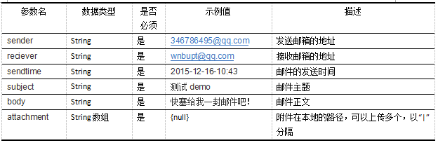

# ibot

a bot that helps people to summary document in different way.

##### 版本
0.1.0
##### 访问地址
http://111.207.243.70:8088/IbotInfo/GetInfo

##### 访问方式  
POST

##### 参数

##### 返回值  

##### 返回示例
{"地点":"北京","项目名称":"农夫之家","公司名称":"北京市农业科技有限公司","成立者":"张三","融资额度":30000,"出让股权":"20%","行业":"农业","置信程度":0.5}
##### curl示例
	curl -d "sender=346786495@qq.com&reciever=wnbupt@qq.com&sendtime=2015-12-16-10:43&subject=测试demo&body=快塞给我一封邮件吧！&attachment=null" http://111.207.243.70:8088/IbotInfo/GetInfo
##### java示例  

        String pathUrl = "http://111.207.243.70:8088/IbotInfo/GetInfo";  
		String sendInfo="346786495@qq.com";
		String recieveInfo="wnbupt@qq.com";
		String timeInfo="2015-12-16-10:43";
		String subjectInfo="测试demo";
		String bodyInfo="快塞给我一封邮件吧！";
		String[] appendInfo={"null"};//本地的附件地址
		
		String sender=URLEncoder.encode(sendInfo,"UTF-8");  
        String reciever=URLEncoder.encode(recieveInfo,"UTF-8"); 
        String sendtime=URLEncoder.encode(timeInfo,"UTF-8"); 
        String subject=URLEncoder.encode(subjectInfo,"UTF-8"); 
        String body=URLEncoder.encode(bodyInfo,"UTF-8");   
        String sendMsg=("sender="+sender+"&reciever="+reciever+"&sendtime="+sendtime+"&subject="+subject+"&body="+body+"&attachment=");
        int i;
        for(i=0;i<appendInfo.length-1;i++)
        {
        	appendInfo[i]=URLEncoder.encode(appendInfo[i],"UTF-8");
        	sendMsg=sendMsg+appendInfo[i]+"|";
        }
        appendInfo[i]=URLEncoder.encode(appendInfo[i],"UTF-8");
    	sendMsg=sendMsg+appendInfo[i];	 
		//System.out.println(sendMsg);

		URL url = new URL(pathUrl);
        HttpURLConnection conn = (HttpURLConnection) url.openConnection();
        conn.setDoOutput(true);   
        conn.setDoInput(true);    
        conn.setRequestMethod("POST");    // POST方式
        conn.setRequestProperty
        ("User-Agent", "Mozilla/4.0 (compatible; MSIE 6.0; Windows NT 5.0)");
        conn.setRequestProperty("Content-Type", "application/x-www-form-urlencoded");       
        conn.connect();
        
        OutputStreamWriter osw = new OutputStreamWriter(conn.getOutputStream());                     
        osw.write(sendMsg);
        osw.flush();
        osw.close();
              
        BufferedReader reader = null;
	    StringBuffer sbf = new StringBuffer();	
        java.io.InputStream is = conn.getInputStream();
        //InputStream is = (InputStream) connection.getInputStream();
        reader = new BufferedReader(new InputStreamReader(is,"utf-8"));
        String strRead = null;
        while ((strRead = reader.readLine()) != null) {
        	//System.out.println(strRead);
            sbf.append(strRead);
            sbf.append("\r\n");
        }
        reader.close();
        System.out.println(sbf);

